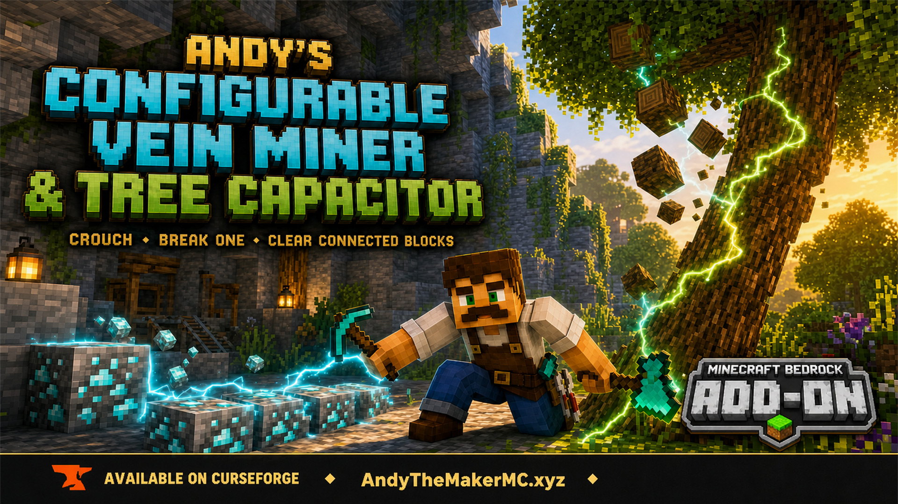

<p align="center">
  <a href="https://www.curseforge.com/minecraft-bedrock/addons/andys-configurable-vein-miner-and-tree-capacitor">
    
  </a>
</p>

# Andy's Configurable Vein Miner and Tree Capacitor

Crouch-mine connected ores and materials, fell trees, and shear leaves—with every target controlled by a world setting that starts off.

Current release: **2.1.0**

## Download

[Download Andy's Configurable Vein Miner and Tree Capacitor 2.1.0](./Andys%20Configurable%20Vein%20Miner%20and%20Tree%20Capacitor%202.1.0.mcaddon)

SHA-256:

```text
141E93979E76355157E6BEFD47A2A3A4D13A359700A4F379055FE948ACE3323F
```

- Minimum Minecraft Bedrock version: **1.26.30**
- Required experiments: **None**
- Required dependencies: **None**
- Resource pack: **Not required**
- Graphics: **Standard and Vibrant Visuals compatible**

## Why two behavior-pack entries appear

This remains one add-on and one download. Bedrock limits one pack manifest to 50 setting elements, so the 72 switches are divided between two linked entries:

- **Andy's Configurable Vein Miner and Tree Capacitor** — Main Pack (1 of 2)
- **Andy's Configurable Vein Miner - Required Block Settings (2 of 2)**

Activate the main pack and keep both active. Minecraft should activate the required companion automatically. Open the gear/settings button on both entries to configure every option. The companion is not a duplicate and does not contain another mining engine.
- Optional compatibility: **All In One Tool and Core Craft**

## Highlights

- 72 settings, all disabled by default
- 67 independently controlled material groups
- Ores, Tree Logs, and Leaves categories
- Pickaxe, axe, shovel, hoe, and shears support
- Exact per-block Survival durability and Unbreaking behavior
- Optional 3% tool protection
- Fortune, Silk Touch, custom loot-table, and tool-condition support
- Matching break sound for every additional block
- Paced, overlapping connected waves with performance limits
- Exact-type tree isolation and bounded face-connected leaves
- Live tracking for gravel, sand, concrete powder, suspicious sand, and suspicious gravel
- Drops gathered at the first broken block

## Install

1. Download the linked `.mcaddon`.
2. Do not extract or recompress it.
3. Open it with Minecraft and wait for a successful import.
4. Create a world or edit an existing world.
5. Open **Behavior Packs → My Packs**.
6. Activate **Andy's Configurable Vein Miner and Tree Capacitor** (Main Pack 1 of 2).
7. Confirm **Required Block Settings (2 of 2)** is also active; activate it manually if necessary.
8. Open the gear/settings button on both entries.
9. Enable the groups you want. A visible `|` is on; `O` is off.
10. Enter the world.

For console play, import and configure the world on a supported Windows or mobile device, upload/apply it through a Realm, and join that Realm from the console.

## Use

1. Enable the exact target group.
2. Hold its correct tool.
3. Crouch before breaking the first block.
4. Break one enabled block.
5. Remain crouched and keep the same tool equipped while the wave runs.

Release crouch or change tools to stop.

## Essential behavior

- Ores and individual materials connect by faces, edges, and corners.
- Individual materials require the same runtime block identifier even when related identifiers share a setting. Legacy variants stored only as block states can connect across those states.
- Logs connect by faces, edges, and corners and use exact types by default.
- **Combine Stripped + Normal Logs** optionally joins same-family variants.
- Leaves use exact types, face-only connections, and a bounded canopy search.
- Each operation can process up to 512 additional blocks.
- Every additional durability-consuming block costs one tool-use opportunity.
- Minecraft loot tables evaluate Fortune, Silk Touch, custom drops, and tool conditions.

The **Suspicious Sand + Gravel** setting can destroy hidden archaeology contents because vein mining is not brushing. Leave it off until valuable suspicious blocks have been brushed normally.

## Optional compatibility

Supported All In One Tool items can fill pickaxe, axe, shovel, and hoe roles, but do not replace shears. Core Craft 1.2.1 support covers recognized ores, mud, trees, leaves, moss, and standard-tagged tools. Both add-ons are optional and are not bundled.

## Complete user guide

Read the [GitHub Wiki](https://github.com/CharlesJGantt/andys-configurable-vein-miner-and-tree-capacitor/wiki) for:

- every supported block group and tool;
- installation, updating, and console-via-Realm guidance;
- connection rules, trees, leaves, durability, drops, sounds, and limits;
- compatibility and detailed symptom-to-fix troubleshooting;
- server, Realm, and content-creator permissions.

## Follow and support Andy

Visit [AndyTheMakerMC.xyz](https://AndyTheMakerMC.xyz) for Andy's add-ons, world lore, tutorials, guides, videos, and other Minecraft content.

Follow **@AndyTheMakerMC** on [YouTube](https://www.youtube.com/@AndyTheMakerMC), [Twitch](https://twitch.tv/AndyTheMakerMC), [X](https://x.com/AndyTheMakerMC), [TikTok](https://www.tiktok.com/@AndyTheMakerMC), and [Instagram](https://www.instagram.com/AndyTheMakerMC).

Support future projects through [Ko-fi](https://ko-fi.com/andythemaker) or [direct Stripe support](https://buy.stripe.com/4gM4gz0qu0xwgxw0IfcMM00).

## Project links

- [CurseForge](https://www.curseforge.com/minecraft-bedrock/addons/andys-configurable-vein-miner-and-tree-capacitor)
- [GitHub Wiki](https://github.com/CharlesJGantt/andys-configurable-vein-miner-and-tree-capacitor/wiki)

Minecraft is a trademark of Microsoft. This project is not affiliated with or endorsed by Microsoft or Mojang.
